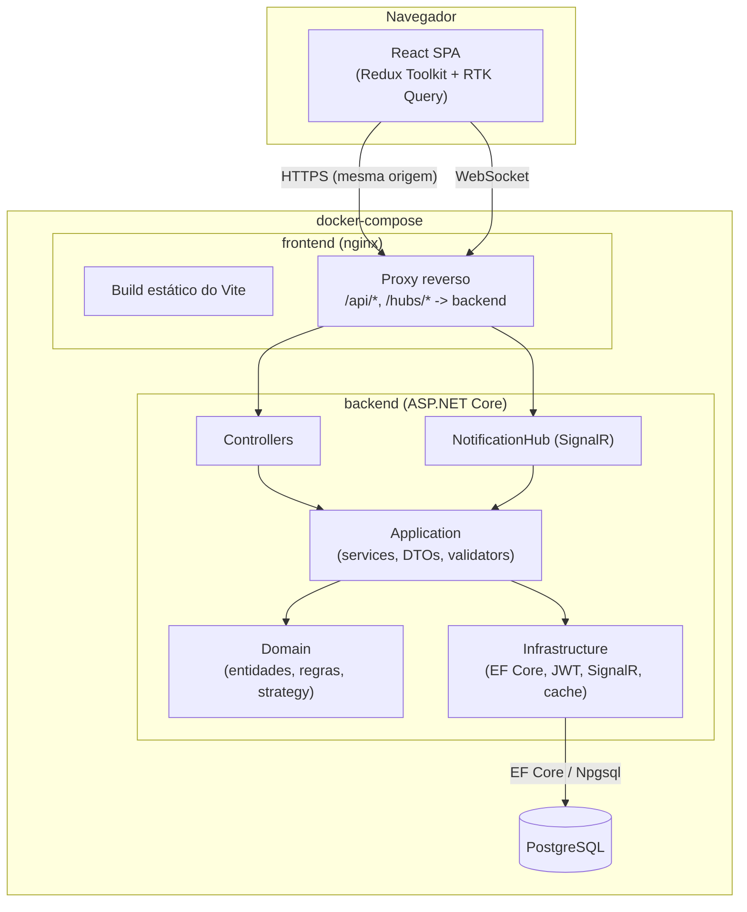

# Arquitetura

> Também disponível como diagrama editável em [`architecture.drawio`](architecture.drawio) — abra em [draw.io](https://app.diagrams.net/) (File → Open From → Device).

## Visão geral

## Camadas do backend (Clean Architecture)

| Camada | Responsabilidade | Não depende de |
|---|---|---|
| **Domain** | Entidades ricas (`Projeto`, `Tarefa`, `Usuario`, `Notificacao`), enums, exceções de negócio, `IStatusTransitionStrategy` (Strategy pattern), interfaces de repositório | Nenhuma outra camada |
| **Application** | Casos de uso (`ProjetoService`, `TarefaService`, `DashboardService`, `AuthService`...), DTOs, validação (FluentValidation), abstrações de infraestrutura (`IJwtTokenGenerator`, `IRealtimeNotifier`, `IPasswordHasher`) | Domain |
| **Infrastructure** | Implementações concretas: EF Core + PostgreSQL, Repository/UnitOfWork, JWT, BCrypt, SignalR Hub, cache em memória | Domain, Application |
| **API** | Controllers REST, middleware de exceções, filtro de validação, Swagger, autenticação JWT, CORS, rate limiting, Serilog | Application, Infrastructure |

A regra de dependência aponta sempre para dentro (API/Infrastructure → Application → Domain), então as regras de negócio no Domain não sabem que existe um banco de dados, uma API REST ou um SignalR Hub.

## Fluxo de uma notificação em tempo real

1. Cliente chama `PUT /api/tarefas/{id}` ou `POST /api/tarefas` atribuindo/reatribuindo um responsável.
2. `TarefaService` detecta a mudança de responsável (`Tarefa.AtribuirResponsavel`), persiste uma `Notificacao` via `IUnitOfWork` e chama `IRealtimeNotifier.NotificarUsuarioAsync`.
3. `SignalRRealtimeNotifier` (Infrastructure) publica no grupo `user:{id}` do `NotificationHub`.
4. O frontend, conectado ao hub com o JWT do usuário, recebe o evento `ReceberNotificacao` e exibe um toast + atualiza o sininho de notificações.

## Por que sem Kubernetes/rate limiting avançado

O rate limiting nativo do ASP.NET Core (`Microsoft.AspNetCore.RateLimiting`, fixed window por IP) já está implementado. Manifests de Kubernetes foram deliberadamente deixados de fora do escopo desta entrega — ver seção "Melhorias Futuras" no README principal.
